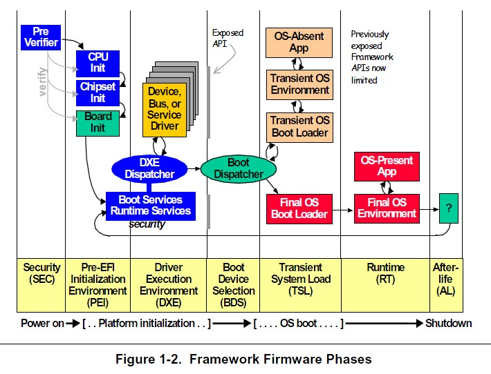
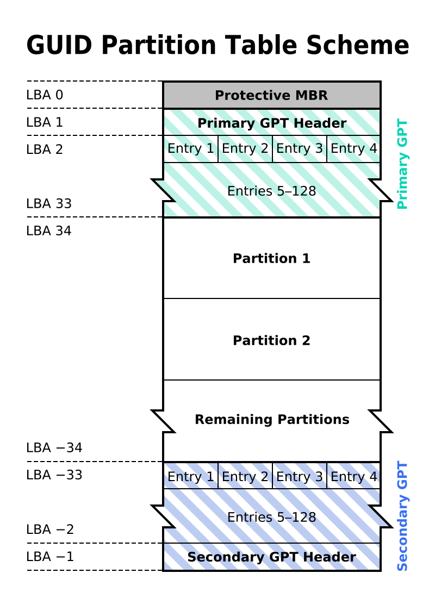
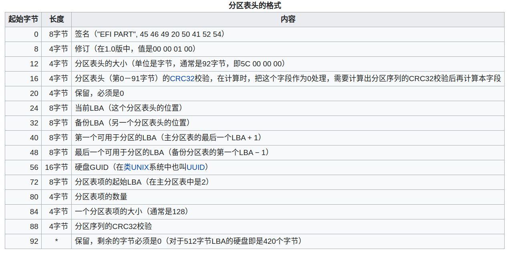
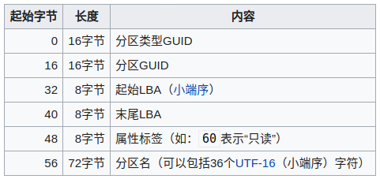

# Linux 启动流程

## 目录

1. Linux 系统概述
    - 操作系统是什么
    - 操作系统包含哪些部分
    - Linux 简史

2. Linux 启动流程概述
    - UEFI
    - Boot Loader
    - Kernel

3. UEFI
4. Boot Loader
5. Kernel

## Linux 系统概述

### 操作系统是什么

1. 操作系统是大型的、复杂的和长寿命的程序。
2. 操作系统主要执行两个任务：
    - 提供接口。隐藏硬件，为程序员提供方便的接口——系统调用。
    - 管理资源。管理处理器、存储器、I/O接口设备等。

### 操作系统包含哪些部分

- 进程管理
- 存储管理
- 文件系统
- I/O
- 设备管理
- 安全

### Unix/Linux 简史（正经篇）

- 1969年8月，美国贝尔实验室的Ken Thompson写了第一个版本的操作系统，后来被命名为Unix。
- 1972年~1973年，Dennis Ritchie发明了C语言，并和Ken Thompson使用C语言重写了Unix。
- 1974年，Dennis Ritchie和Ken Thompson发布论文《The UNIX Time-Sharing System》，首次公开Unix。
- 1987年，Andrew Tanenbaum写了一个小型的Unix系统——Minix，用于操作系统教学。
- 1991年，Linus Torvalds在Minix的灵感下，写了Linux 0.0.2版本，并对外宣布了Linux项目。
- 1992年，在GNU GPL下Linux内核被重新授权使用，产生第一个Linux发行版本。

### Unix/Linux 简史（八卦篇）

- 1969年，为了在一台旧的PDP-7机器上继续玩自己写的“星际旅行”游戏，Ken Thompson最终开发出Unix系统。
- 在妻儿去探亲的一个月内，Ken Thompson用汇编语言写出了Unix系统的原型，包括内核、shell、编辑器等。
- 1983年，Dennis Ritchie和Ken Thompson因为发明了Unix和C语言而共同获得当年的图灵奖。
- 2006年，Ken Thompson加入Google公司工作。2007年，他、Rob Pike和Robert Griesemer共同发明了Go语言。
- 1991年，当Linus Torvalds写出Linux的第一个版本时，他还在芬兰的赫尔辛基大学读书，年仅22岁。
- 2005年，由于Linux内核社区不能够继续免费使用BitKeeper（一个分布式版本控制系统），Linus Torvalds在两周内开发出Git的最初版本。

## Linux 启动流程概述

1. UEFI
    - 上电自检（Power-On Self Test, POST)。检测CPU各寄存器、计时芯片、中断芯片、DMA 控制器等。
    - 枚举设备。初始化寄存器，分配中断、IO 端口、DMA 资源等。
    - 加载Boot loader到内存并执行。

2. Boot loader（以GRUB为例）
    - 提供BOOT启动菜单，允许用户选择加载哪个操作系统。
    - 将指定的操作系统内核加载到内存并执行。

3. 内核
    - 内核引导
    - 内核初始化

## UEFI

### UEFI 启动流程

1. Security Phase (SEC): 初始化临时内存（Cache As RAM）
2. Pre-EFI Initialization (PEI): 初始化CPU、芯片组、主存、Board
3. Driver Execution Environment (DXE): 初始化硬件驱动、总线
4. Boot Device Select (BDS): 初始化I/O设备、提供设置和选择启动设备的UI
5. Transient System Load (TSL): 加载boot loader 并运行
6. Runtime (RT): boot loader 加载内核并运行

### GUID Partition Table (GPT)

1. 寻址方式：逻辑区块地址（Logical Block Address, LBA）
2. GPT分配64 bits给逻辑区块地址，最大分区数为（2^64 -1），若扇区大小为512 bytes，则总大小为(9.4 * 10^21) bytes.
3. 为减少分区表损坏的风险，GPT在硬盘最后保存了一份分区表的副本。

### GPT 分区表头

### GPT 分区表项

## Boot Loader

## Kernel

### 进程

#### 第一个进程

1. 第一个进程是怎么产生的？
2. 第一个进程主要做了什么事情？

#### 进程的创建

#### 进程的终止：8种方式

进程的终止方式有8种，其中5种为正常终止，3种为异常终止。

1. 正常终止方式（5种）
    - 从main返回
    - 调用exit
    - 调用`_exit`或`Exit`
    - **最后一个线程从其启动例程返回**
    - **从最后一个线程调用pthread\_exit**

2. 异常终止方式（3种）
    - 调用abort
    - 接到一个信号
    - **最后一个线程对取消请求做出响应**

#### 进程的终止：无辜的主机服务 vs 顽固的算法进程

1. C1主机服务两次因调用嵌入式接口而终止
    - 调用嵌入式接口get_speed获取GPS速度，因该函数调用exit而终止
    - 调用嵌入式接口时，由于double free问题，导致主机服务收到SIGSEGV信号而终止

2. C1算法进程收到SIGTERM信号超过10秒后仍然不终止
    - 算法程序注册了SIGTERM的处理函数，其中释放ORC VPU资源耗时甚长
    
#### 线程

#### 进程环境

- 进程的栈空间最大值是多少？
- 进程的CPU占用率最大是多少？
- 进程的内存占用率最大是多少？

#### 进程间通信

## 疑问

### 进程

- 操作系统何时会给进程发送信号？
- 理解lsof的用法？
- 理解/proc/pid/status，top，ps的输出含义？
- 进程的资源有哪些？进程的内存管理是怎样的？
- go语言进程的栈大小是多少？是否可能溢出？

- C1项目前期为什么无法关闭算法进程？
- 为什么无法使用`Ctrl-C`关闭python脚本？
- 后台进程是什么？跟普通进程有什么区别？

### 文件

- 文件在磁盘中是如何存储的？iNode是什么？
- Linux系统中的文件权限和所有者信息存储在哪里？ 为什么有时拷贝文件会丢失权限？（尤其是在不同操作系统间拷贝文件时）
- 一个进程写某个文件，另一个进程同时读这个文件能成功吗？
- 如何理解Unix系统“一切皆文件”的思想？
- 挂载究竟是什么意思？
- 运行一个二进制文件时能否重写它？
- 管道是什么？

### I/O

- 什么是控制台？
- tty是什么？
- 流是什么？
- 学习syslog原理，理解如何重定向log到socket
- 什么是异步I/O？
- 什么是FIFI？

### 设备驱动

- ifconfig的用法与含义
- netstat的用法
- 理解tcpdump的用法？
- USB转网口的原理是什么？
- 理解虚拟网卡的原理？usb接口和can接口均可用作虚拟网卡？

## 参考资料

1. [UNIX传奇（上篇）](https://coolshell.cn/articles/2322.html)
2. [UNIX传奇（下篇）](https://coolshell.cn/articles/2324.html)
3. [UNIX 40年：昨天，今天和明天](https://coolshell.cn/articles/1023.html)
